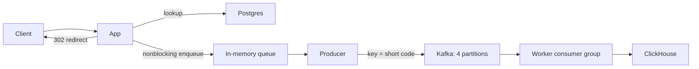

# URL shortener

## Functional requirements

- POST to make a new short URL
- GET a short URL to redirect to its original long URL
- Short codes must be exactly 7 characters long
- Short codes should not be easily guessable
- A successful redirect must record an event

## Non-functional requirements

- 100m new URLs created a day
- 1b redirects a day
- The service will run for 10 years
- redirects must favor availability over consistency

## Napkin maths

- 10 years × 365 days × 100m new URLs = 365b short URLs
- 62⁶ ≈ 56.8b possible codes, which is not enough
- 62⁷ ≈ 3.52 trillion possible codes, so 7 Base62 characters provide enough capacity
- ~500 B–1 KB per row × 365B rows = ~180–365 TB raw data. At this scale, Postgres would likely need to be sharded, so I’d design for sharding early

## Decisions and tradeoffs

### Short URL generation

There are two approaches we could take.

#### 1. Store an auto-incrementing ID and Base62-encode it

For this approach, the database stores the ID and destination URL. The code is
derived from the ID, so it does not need its own column:

```sql
CREATE TABLE short_url (
    id BIGINT GENERATED ALWAYS AS IDENTITY PRIMARY KEY,
    url TEXT NOT NULL
);
```

To create a short URL, insert the destination and return the generated ID:

```sql
INSERT INTO short_url (url) VALUES ($1) RETURNING id;
```

Base62-encode the returned ID using `0123456789ABCDEFGHIJKLMNOPQRSTUVWXYZabcdefghijklmnopqrstuvwxyz`.
For example, ID `12345` becomes `3D7`. Pad it with leading zeroes to meet the
7-character requirement: `00003D7`.

To resolve a short URL, Base62-decode the code back into its integer ID, then
look up the destination using the primary key:

```text
GET /00003D7 → decode Base62 → ID 12345 → look up row → 302 redirect
```

```sql
SELECT url FROM short_url WHERE id = $1;
```

Here `$1` is the decoded ID (`12345`), not the short-code string. Reject invalid
codes and return 404 when no row exists. The primary key already provides an
index for this lookup.

**Pros**

- No need to store or index a separate short code.
- Guarantees unique codes when IDs are unique and never reused: each ID has a
  different Base62 representation. No random-code collision retries are needed.
- Resolving a code uses a direct primary-key lookup.

**Cons**

- Predictable: sequential IDs produce sequential codes, making other URLs easy
  to enumerate and exposing the approximate sequence position.
- Codes eventually exceed 7 characters once IDs reach `62⁷`. Padding only fixes
  shorter codes; it cannot keep larger IDs within the limit. Enforcing the
  requirement means stopping allocation before that point or changing the scheme.

The projected 365b URLs fit within the 7-character space. The length limit still
needs enforcing because sequences can have gaps and the service could outgrow
the estimate.

#### 2. Generate a random 7-character Base62 code (chosen)

Generate each character independently using a cryptographically secure random
number generator. For each of the 7 positions, pick an index from 0 to 61 in
`0123456789ABCDEFGHIJKLMNOPQRSTUVWXYZabcdefghijklmnopqrstuvwxyz`. This produces a
code such as `aB3x9Qz`, independent of the row's ID.

The database stores the generated code alongside the destination URL:

```sql
CREATE TABLE short_url (
    id BIGINT GENERATED ALWAYS AS IDENTITY PRIMARY KEY,
    code TEXT NOT NULL UNIQUE,
    url TEXT NOT NULL
);
```

To create a short URL, generate a code and attempt to insert it:

```sql
INSERT INTO short_url (code, url)
VALUES ($1, $2)
ON CONFLICT (code) DO NOTHING
RETURNING id;
```

If the code already exists, the insert returns no row. Generate a fresh code and
try again. The current implementation allows one initial attempt plus 10 retries,
then returns an error if none succeeds. Other database errors are not retried.

The unique constraint guarantees that two concurrent requests cannot insert the
same code. We attempt the insert directly; checking whether a code exists first
would leave a race between the check and the insert.

To resolve a short URL, look up the stored code directly:

```text
GET /aB3x9Qz → look up code aB3x9Qz → 302 redirect
```

```sql
SELECT id, code, url FROM short_url WHERE code = $1;
```

Here `$1` is the short-code string (`aB3x9Qz`). There is no ID to decode. Return
404 when no row exists. `UNIQUE (code)` creates the index used for this lookup.

**Pros**

- Always generates exactly 7 characters, regardless of how large the row ID gets.
- Codes do not reveal the row ID or follow a predictable sequence.
- App instances can generate candidate codes independently; Postgres enforces
  uniqueness when they insert them.
- Resolving a code uses an indexed lookup.

**Cons**

- Random generation does not guarantee uniqueness. Collisions require another
  insert attempt, adding work and latency.
- Must store the code and maintain its unique index, adding storage and write cost.
- Collisions become more frequent as the fixed `62⁷` code space fills. Creation
  can fail after the retry limit, even when unused codes remain.

**Why we chose it**

It keeps codes at the required 7 characters and avoids exposing sequential IDs.
We accept the extra storage and collision retries, with the database enforcing
uniqueness. The 3.52 trillion possible codes accommodate the projected 365b URLs,
but collisions still need handling well before the space fills.

### Redirect analytics

The redirect handler queues an event in memory, and the Kafka producer sends it
in the background. Workers in one consumer group read the topic and batch events
into ClickHouse. Postgres continues to store URL mappings.



#### Async capture vs transactional outbox

| Approach | Redirect path | Failure tradeoff |
| --- | --- | --- |
| Async capture (chosen) | Enqueue without waiting for Kafka or ClickHouse | Redirects continue during analytics outages, but events can be lost |
| Transactional outbox | Commit an outbox row in Postgres before returning the redirect; a relay publishes it later | Survives app crashes after commit and Kafka outages, but redirects depend on a successful database write |

An [outbox](https://microservices.io/patterns/data/transactional-outbox.html)
atomically records an event alongside a business database change. Our redirect
normally only reads a URL, so it would introduce a write on every redirect.
The relay can retry, but consumers still need deduplication. Neither approach
can atomically commit an event and prove the client received the HTTP response.

I chose redirect availability and latency over guaranteed event capture.
The bounded queue holds up to 10,000 events per app by default. Failed Kafka
batches retry in the background; when the queue fills, new events are dropped.
A process crash can lose queued events. Graceful shutdown gives the producer
five seconds to drain.

#### Partitioning and workers

The short code is the Kafka message key. The producer uses `kafka.Hash`: FNV-1a
with the library's signed-hash/modulo partition selection. With a fixed partition
count, every producer sends the same short code to the same partition.

Four partitions and four worker replicas are the defaults. Kafka assigns each
partition to one consumer in the group. Fewer workers can own multiple partitions;
extra workers beyond the partition count sit idle. Each worker processes its
batches sequentially and commits offsets only after ClickHouse accepts them.

Ordering means Kafka append order within a partition, not a global order or
wall-clock order across app instances. Retries can duplicate records. Stored
partition/offset fields allow events to be read in Kafka order. Changing the
partition count changes key placement, so startup rejects a mismatch on an
existing topic. Use a planned topic migration rather than resizing a live stream
when per-code ordering matters.

#### Event identity and storage

Events contain a unique event ID, schema version, short code, UTC timestamp, and
`user_id`. The user ID is an HMAC-SHA256 hash of `User-Agent` and `Accept-Language`
using a key shared by app replicas. Raw headers and IP addresses are not stored.
Identical browser signatures share an ID, and browser changes can change it.
This measures approximate browser signatures.

ClickHouse is the chosen analytics store because this is an append-heavy event
workload with aggregate queries at a projected 1b events/day. Postgres keeps the
transactional URL lookups separate from analytics ingestion and scans. Postgres
would be a simpler starting point for a much smaller event workload.

Delivery after Kafka is **at least once**. Workers retry storage failures without
committing offsets. If a worker crashes after inserting but before committing,
the event is replayed with the same ID. The ClickHouse table uses
[ReplacingMergeTree](https://clickhouse.com/docs/engines/table-engines/mergetree-family/replacingmergetree)
with the event ID in its sorting key. Background merges remove duplicates;
queries needing deduplicated results use `FINAL` (or count distinct event IDs).
This is not an exactly-once delivery guarantee.
